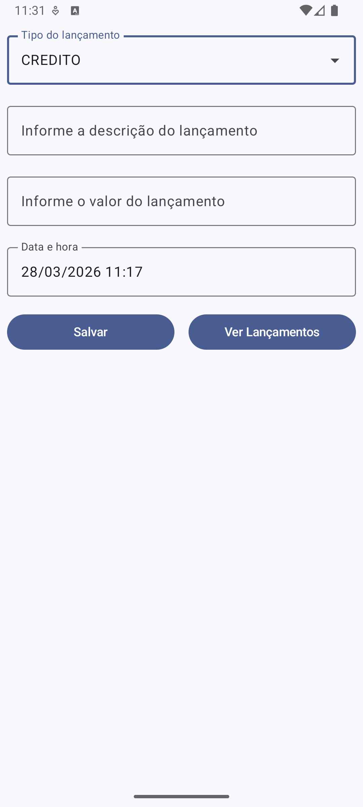
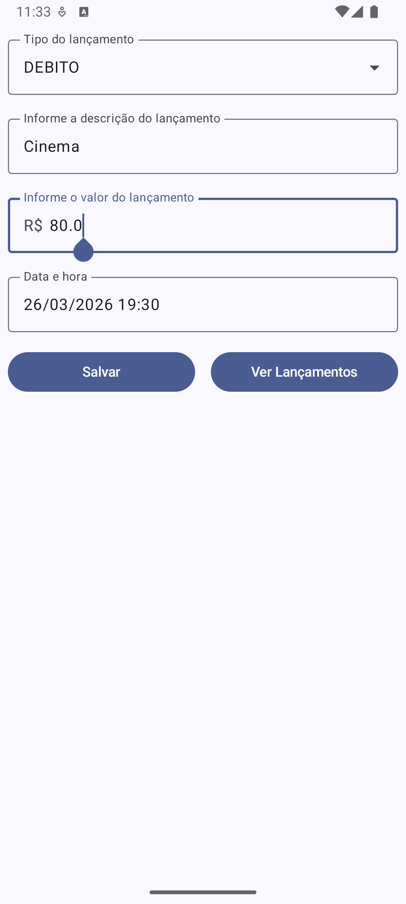
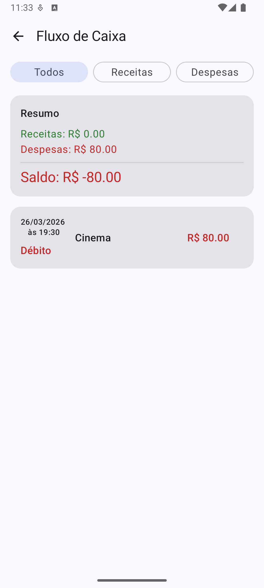
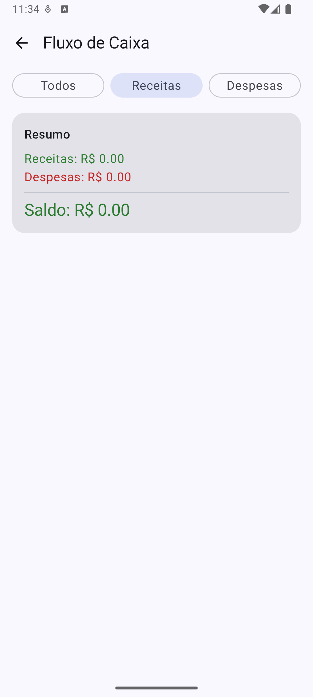
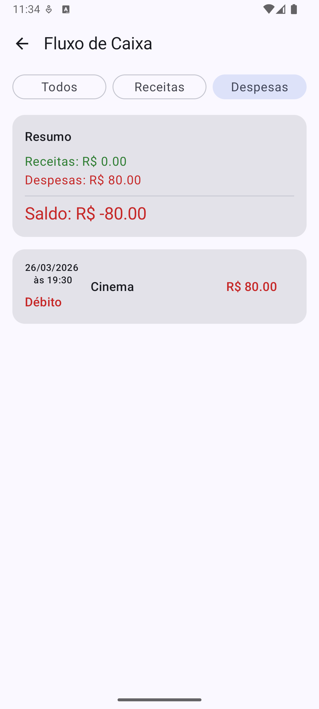

# FinanceFlow - Aplicativo de Fluxo de Caixa

Aplicativo Android desenvolvido como atividade final da disciplina de **Android Aplicado** — projeto para gerenciamento de receitas e despesas.

---

## 📝 Descrição da Atividade

**Trabalho Final — Android Aplicado** (Trabalho em dupla)

O objetivo deste desafio é desenvolver um aplicativo nativo para Android utilizando Kotlin. A avaliação enfoca a capacidade de organizar o código, implementar interfaces e lidar com o fluxo de dados entre telas, assim como realizar a persistência dos dados, organizando o conteúdo em camadas (MVVM). O app é um simples controle financeiro que permite registrar entradas e saídas e visualizá-las em uma lista.

### Especificações das Telas

#### 1. Tela de Lançamento (Cadastro)
Esta é a porta de entrada do app. O usuário deve ser capaz de registrar uma nova movimentação.

**Campos necessários:**
- **Valor:** Campo numérico para o valor monetário (R$).
- **Descrição:** Texto curto (ex: "Aluguel", "Salário").
- **Data:** Digitação da data do lançamento (pode ser feito via DatePicker ou campo de texto formatado).
- **Tipo:** Seleção entre "Receita" (Crédito) ou "Despesa" (Débito) — pode ser um RadioButton ou Switch.

**Ação:** Botão "Salvar" que valida os campos e persiste os dados no banco de dados (SQLite local ou Firebase Realtime Database).

#### 2. Tela de Extrato (Fluxo de Caixa)
A tela principal do aplicativo deve exibir o histórico de tudo o que foi lançado.

- **Lista:** Deve exibir cada item com sua descrição, data e valor.
- **Diferenciação Visual (Opcional/Bônus):** Itens de "Receita" devem ter um destaque visual diferente de "Despesa" (ex: cores verde/vermelho ou ícones indicadores).
- **Resumo (Opcional/Bônus):** Um pequeno cabeçalho ou rodapé exibindo o saldo total (Soma das receitas - Soma das despesas).

### Critérios de Avaliação (Checklist com 10 itens)

- [x] Desenvolvimento da tela principal
- [x] Desenvolvimento da tela de listagem
- [x] Consistência dos campos de entrada da tela principal (lançamento)
- [x] Persistência de dados no banco de dados
- [x] Navegabilidade entre telas
- [x] Organização do código (MVC ou MVVM)
- [x] Apresentação dos dados na lista utilizando adapter
- [x] **plus** – Uso de datepicker
- [x] **plus** – Diferenciação de crédito e débito na tela de listagem
- [x] **plus** – Apresentação do saldo

---

## 🛠️ Tecnologias e Dependências

- **Linguagem:** Kotlin
- **UI:** Jetpack Compose
- **Navegação:** Navigation Compose
- **Persistência:** SQLite via SQLiteOpenHelper
- **Estrutura do código:** ViewModel + Entities + Enums
- **Data/Time:** APIs Java Time (LocalDateTime, DateTimeFormatter)
- **Outros:** Compose Material icons, componentes de DatePicker/TimePicker

---

## 📱 Funcionalidades

- **Cadastro de lançamento**: Tipo (Crédito/Débito), descrição, valor e data/hora.
- **Persistência local**: Inserção e listagem via SQLite.
- **Extrato filtrado**: Filtros por tipo (Todos / Receitas / Despesas).
- **Resumo financeiro**: Cálculo de total de receitas, total de despesas e saldo (com cores para sinalizar positivo/negativo).
- **Validações básicas**: Verifica preenchimento da descrição e valor maior que zero.
- **Interface**: Jetpack Compose + Material3 com componentes customizados.

---

## 📸 Imagens do Projeto

  
  
  
  
  

---