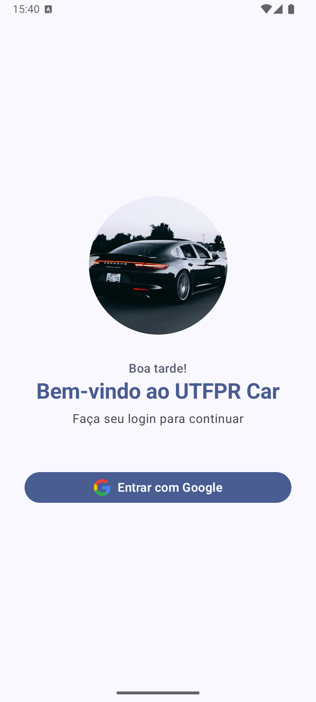
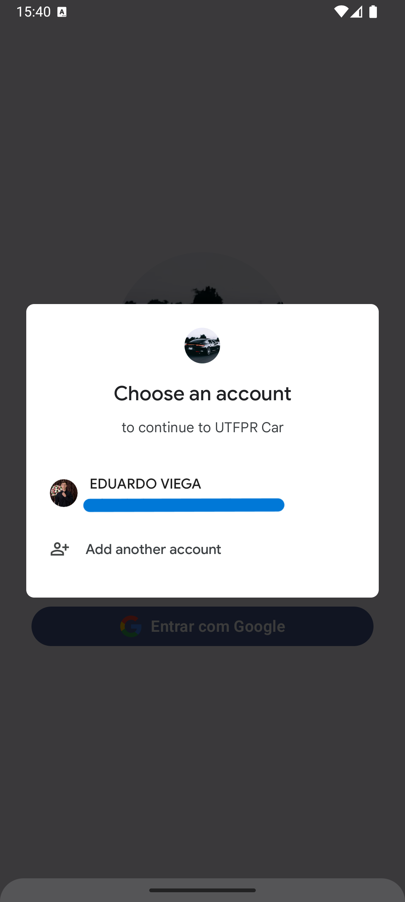
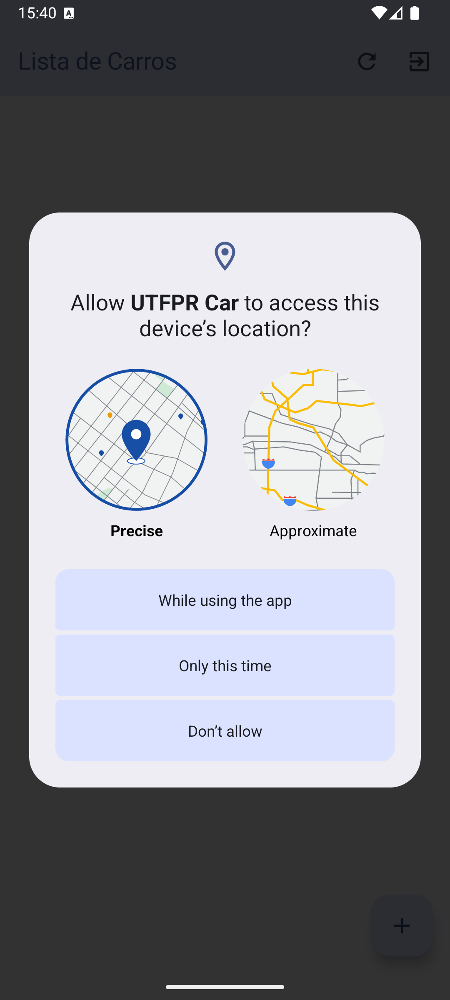
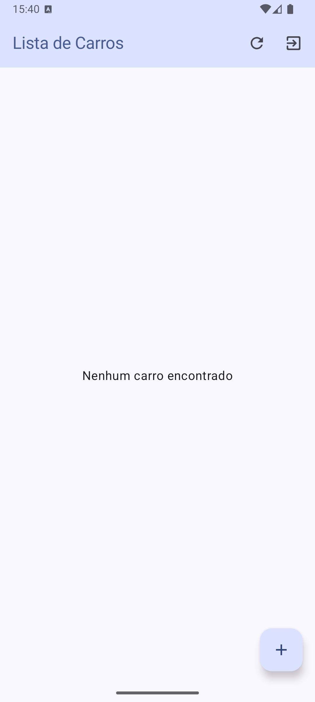
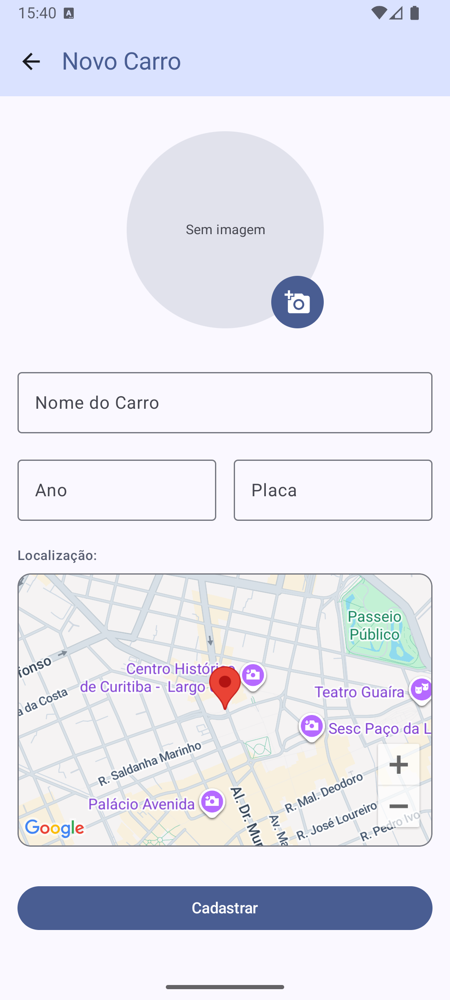
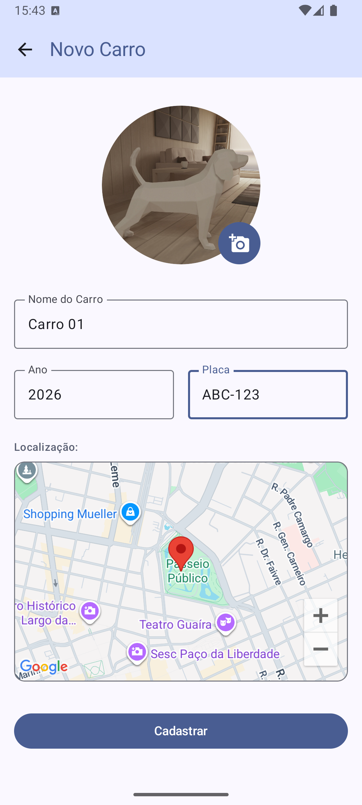
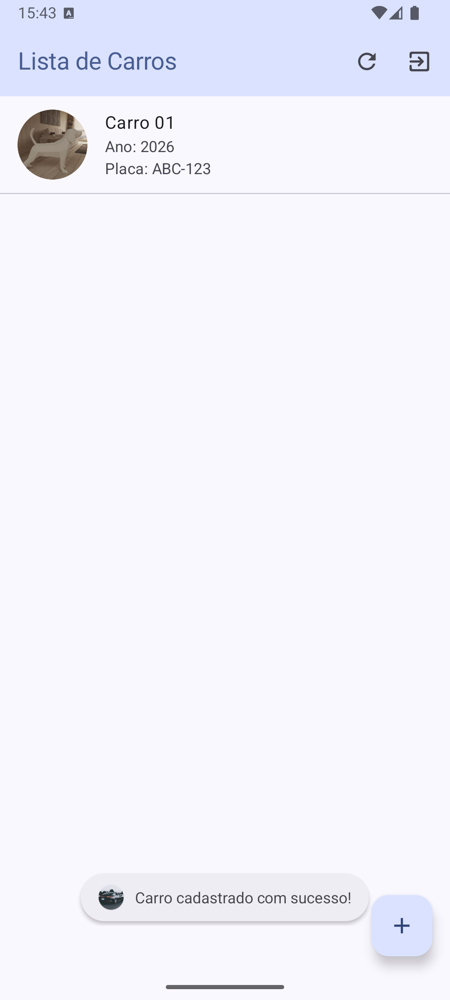
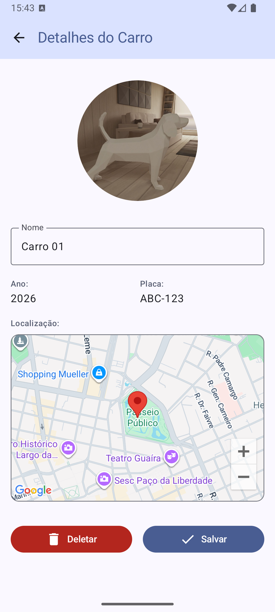

# Projeto UTFPR-Car-API-Android - Pós-Graduação UTFPR

Este repositório contém o projeto final da disciplina de **APIs de Desenvolvimento para Dispositivos Móveis** da Pós-Graduação em Programação para Dispositivos Móveis.

O repositório é composto por dois projetos:
- **UTFPR-Car-API-Android**: Aplicativo Android nativo, sendo o principal.
- **UTFPR-Car-API-Node**: API REST utilizada como backend para armazenamento dos dados.

---

## 📝 Descrição da Atividade

O objetivo deste exercício foi integrar diferentes tecnologias fundamentais do ecossistema Android em um único fluxo de aplicação:
1. **Autenticação**: Implementação de login seguro utilizando o Firebase Authentication (sugerido pelo professor o sms, podendo implementar outro de preferencia do aluno).
2. **Integração REST**: Consumo de uma API REST Node.js para operações de CRUD (Create, Read, Update, Delete) de veículos.
3. **Persistência de Mídia**: Upload e recuperação de imagens de veículos utilizando o Firebase Storage.
4. **Geolocalização**: Integração com Google Maps para exibir e selecionar a localização (lat/long) de cada veículo.

---

## 🛠️ Tecnologias Utilizadas

- **Linguagem**: Kotlin
- **UI**: Jetpack Compose
- **Network**: Retrofit & Gson (JSON)
- **Imagens**: Carregamento e upload via URL do FireStorage e armazenamento local antes de salvar
- **Backend/Serviços**: 
    - Firebase Auth (Google Sign-In)
    - Firebase Storage (Armazenamento de fotos)
    - Google Maps SDK for Android
    - Permissões do Android (Location e Storage)
- **API Base**: Node.js / Express

---

## 📱 Funcionalidades Implementadas

- [x] **Login com Google**: Autenticação via Firebase Auth.
- [x] **Lista de Carros**: Visualização de todos os veículos cadastrados via Retrofit.
- [x] **Cadastro de Veículo**:
    - Captura de foto via Câmera.
    - Upload automático para o Firebase Storage.
    - Seleção de localização através de um mapa interativo.
- [x] **Detalhes e Edição**: Visualização completa das informações, com possibilidade de atualizar dados e localização.
- [x] **Exclusão**: Remoção definitiva de veículos da base de dados.
- [x] **Logout**: Opção de encerrar a sessão e limpar o estado de login.

---

## 📸 Imagens do Projeto

<div>
  
  
  
  
  
  
  
  
</div>

---

## 🚀 Tutorial de Uso

### 1. Configuração do Backend (UTFPR-Car-API-Node)
1. Certifique-se de ter o [Node.js](https://nodejs.org/) instalado.
2. Acesse a pasta `UTFPR-Car-API-Node`.
3. Execute o comando para instalar as dependências:
   ```sh
   npm install
   ```
4. Inicie o servidor:
   ```sh
   node index.js
   ```
   *O servidor rodará por padrão em `http://localhost:3000`.*

### 2. Configuração do Android (UTFPR-Car-API-Android)

#### A. Firebase (Obrigatório)
Para que o projeto funcione, você deve configurar seu próprio projeto no [Firebase Console](https://console.firebase.google.com/):
1. Crie um novo projeto Android com o pacote `br.edu.utfpr.utfpr_car_api_android`.
2. Adicione o arquivo `google-services.json` na pasta `app/`.
3. No console do Firebase, ative:
   - **Authentication**: Provedor "Google".
   - **Storage**: Crie um bucket e defina as regras de segurança apropriadas.

#### B. Google Maps (Obrigatório)
1. Obtenha uma API Key no [Google Cloud Console](https://console.cloud.google.com/).
2. No projeto Android, adicione sua chave no arquivo `AndroidManifest.xml`:
   ```xml
        <meta-data
            android:name="com.google.android.geo.API_KEY"
            android:value="API_KEY" />
   ```

#### C. Conexão com a API
1. O aplicativo está configurado no arquivo `RetrofitClient.kt` para acessar a API em `http://10.0.2.2:3000/` (endereço padrão do emulador para o localhost). Se estiver usando um dispositivo físico, altere para o IP da sua máquina.
2. Se necessário também adicione o IP da sua máquina no aquivo `network_security_config.xml`:
   ```xml
   <domain includeSubdomains="true">IP_ADRESS</domain>
   ```

### 3. Execução
1. Abra o projeto `UTFPR-Car-API-Android` no **Android Studio**.
2. Sincronize o Gradle.
3. Execute o aplicativo em um emulador ou dispositivo físico.

---
